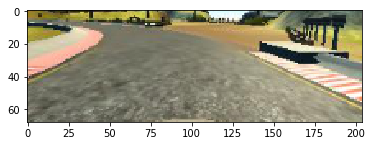
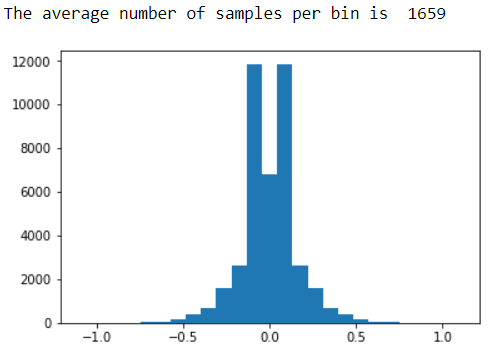
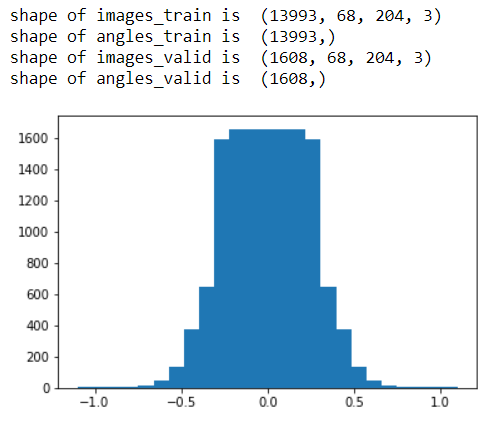

# **Behavioral Cloning**

---

**Behavioral Cloning Project**

The goals / steps of this project are the following:
* Build, a convolution neural network in Keras that predicts steering angles from images
* Train and validate the model with a training and validation set
* Test that the model successfully drives around track one without leaving the road
* Summarize the results with a written report

## Rubric Points
### Here I will consider the [rubric points](https://review.udacity.com/#!/rubrics/432/view) individually and describe how I addressed each point in my implementation.  

---

### Files Submitted & Code Quality

#### 1. Submission includes all required files and can be used to run the simulator in autonomous mode

My project includes the following files:
* `model.py` containing the script to create and train the model
* `drive.py` for driving the car in autonomous mode
* `model.h5` containing a trained convolution neural network
* `writeup_report.md` summarizing the results

#### 2. Submission includes functional code
Using the Udacity provided simulator and my `drive.py` file, the car can be driven autonomously around the track by executing
```sh
python drive.py model.h5
```

#### 3. Submission code is usable and readable

The `model.py` file contains the code for training and saving the convolution neural network. The file shows the pipeline I used for training and validating the model, and it contains comments to explain how the code works.

### Model Architecture and Training Strategy

#### 1. Read and preprocess the data

First, read images and steering angles, which are the dataset provided from Udacity, from the csv file <`model.py` line:10-26>.
Then converted the color space from BGR into RGB for `drive.py`, cropped top 55[pixel] and bottom 20[pixel] (i.e. 160x320x3 ---> 85x320x3), and resized to 68x204 (i.e. 85x320x3 ---> 68x204x3) in order to feed to the NVIDIA's CNN architecture <`model.py` line:27-33>.

<div style="text-align:center">
<br/>
85x320x3
</div><br/>

<div style="text-align:center">
<br/>
68x204x3
</div><br/>

This preprocessing is also implemented in `drive.py` <`drive.py` line:68-69>.
After preprocessing, I split the images and the steering steering angles from the center camera into train dataset (80%) and validation dataset (20%) <`model.py` line:40>.

#### 2. Data augmentation

I added images from the left camera (adjusted the steering angle by +0.1) and the right camera (adjusted the steering angle by -0.1) into images captured by the center camera <`model.py` line:63-81>.
Then flipped the dataset horizontally if the magnitude of the steering angle is grater than 0.001 <`model.py` line:98-106>. It prevents from flipping images that the angle is 0.

#### 3. Flattening the distribution of dataset

After augmentation, the number of train data resulted up to 41491 (the number of validation data is 1608), however the CNN model didn't work well with this dataset. So I visualized the distribution of this dataset.

<div style="text-align:center">
<br/>
The distribution of the train data **before** flattening
</div><br/>

The above figure indicates the number of data around 0.0 is extremely high while the average number of data per bin is 1659. The reason why the center bin (wich means -0.044~+0.044) is lower than both sides (wich means -0.132~-0.044 and +0.044~+0.132) is only flipping the images that the steering angle is grater than 0.001 <`model.py` line:101>.
This extreme deviation would cause inappropriate behavior through the CNN, therefor I flattening the distribution by deleting data ramdomly if the number of the data in one bin is over the average number of samples per bin, which is 1659 <`model.py` line:123-130>. This idea is come from [jeremy-shannon's github repository](https://github.com/jeremy-shannon/CarND-Behavioral-Cloning-Project/blob/master/README.md).

<div style="text-align:center">
<br/>
The distribution of the train data **after** flattening
</div><br/>

After flattening, the distribution of train data resulted as avobe. The deviation became more gentle.

#### 4. Model architecture

I used the NVIDIA's CNN model introduced in the Udacity lesson.

<div style="text-align:center">
<br/>
The NVIDIA's CNN model architecture
</div><br/>

To prevent overfitting, L2 regularization is added in each layer except last output layer. I used 0.0001 for learning rate of Adam optimizer while the default was 0.001 <`model.py` line:161-180>.

#### 5. Train the model

Using generator to feed batch size of sample and `model.save_wights()` to save the training result every epoch, I traind the model 20 epochs and found out that **4** epochs is enough to complete running Track No.1 safely <`model.py` line:190-202>.
